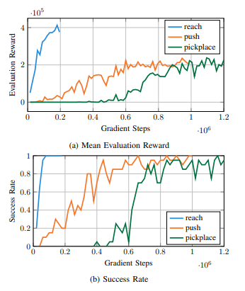
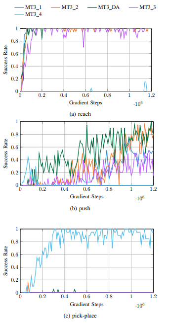
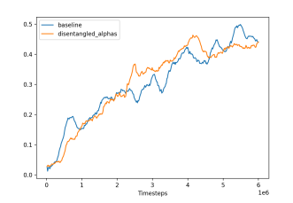

# Multi-Task Reinforcement Learning in Meta-World with SAC

**Course Project: Autonomous Systems Lab (ASL)**  
*Institute of Computer Technology (ICT), Vienna, Austria*
## Repository Structure

- **`ST_SAC/`** -- Single-task SAC training, evaluation, and hyperparameter optimization with Optuna.
- **`MT3_SAC/`** -- Multi-task SAC on 3 tasks (Reach, Push, Pick-Place) with environment balancing and reward scaling.
- **`MT10_SAC/`** -- Multi-task SAC on 10 tasks with one-hot task conditioning, disentangled per-task entropy coefficients, and TensorBoard plotting scripts.
## Project Overview

This project investigates the training of robotic learning agents in the **Meta-World** environment using the **Soft Actor-Critic (SAC)** algorithm. The research progresses from **Single-Task (ST)** settings to **Multi-Task (MT)** scenarios (MT3 and MT10).

The primary goal was to design, train, and evaluate the RL SAC algorithm to handle multiple distinct manipulation tasks simultaneously. We explored various mechanisms to improve performance, including:
*   Hyperparameter optimization (Optuna).
*   Task conditioning (One-hot encoding).
*   Environment balancing.
*   Reward scaling.
*   Disentangled entropy coefficients.

## Methodology

We utilized **Soft Actor-Critic (SAC)** as the baseline algorithm due to its sample efficiency and stability in continuous control tasks.

### Multi-Task Architecture
To enable multi-task learning, we employed **Task Conditioning**:
1.  **Observation:** A one-hot encoded task indicator is appended to the agent's observation.
2.  **Policy:** A shared policy network trains jointly across all tasks.
3.  **Wrapper:** A custom environment wrapper samples tasks (uniformly or weighted) and manages task IDs.

### Disentangled Entropy (SAC-DA)
Standard SAC uses a global entropy coefficient ($\alpha$). In the multi-task setting, this can be limiting. We implemented **Disentangled Entropy Coefficients**, assigning a separate $\alpha_k$ to each task $k$. This allows the agent to adapt its exploration behavior individually for specific tasks while maintaining shared policy parameters.

---

## Experiments & Results

### 1. Single-Task (ST)
We established baselines for *Reach*, *Push*, and *Pick-Place*.
*   **Optimization:** Optuna was used to find optimal hyperparameters.
*   **Findings:** Parameters optimized for the *Push* task generalized well to *Pick-Place*, achieving high success rates.

*(Success rate of SAC for ST tasks during training)*

### 2. Multi-Task 3 (MT3)
We evaluated SAC on a subset of 3 tasks: *Reach, Push, Pick-Place*. Several configurations were tested to overcome task dominance:

| Experiment | Configuration | Result |
| :--- | :--- | :--- |
| **MT3_1 (Baseline)** | Equal envs, standard scaling. | Strong bias toward *Reach*. *Pick-Place* failed. |
| **MT3_2 (Balanced)** | Increased envs for *Pick-Place* (6x). | *Push* improved significantly (0.95 success). *Pick-Place* still failed. |
| **MT3_DA** | Disentangled Alpha. | Improved convergence speed for *Push*. |
| **MT3_4 (Scaled)** | Aggressive reward scaling. | **Pick-Place learned successfully (~1.0)**, but performance on easier tasks degraded. |

**Key Insight:** Reward scaling emerged as the most influential factor in determining which tasks are successfully learned in the MT3 setting.

*(Success rates of single MT3 tasks across different configurations)*

### 3. Multi-Task 10 (MT10)
We benchmarked the agent on 10 distinct Meta-World tasks using a shared [400, 400] network architecture.

*   **Comparison:** Baseline MT-SAC vs. Disentangled-Alpha SAC.
*   **Performance:** Both methods converged to similar mean success rates (**~46%**).
*   **Dynamics:** Disentangled-Alpha showed slightly faster convergence and smoother learning trajectories, though it did not strictly outperform the baseline in final success rate.
*   **Task Difficulty:** Tasks like *Reach* and *Door-Open* were solved easily, while *Push-v3* (momentum-sensitive) and *Pick-Place* remained challenging in the joint setting.

*(Mean success across MT10 tasks for baseline and disentangled-entropy)*

